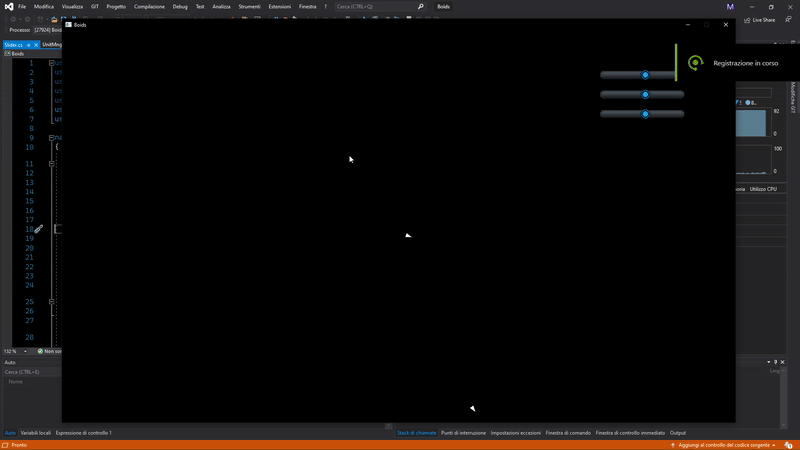

# BoidsSim

Simple boids simulation using [Fast2D](https://github.com/aiv01/aiv-fast2d) and OpenTk.

Spawn <ins>Boids</ins> with left mouse click and tinker with the sliders to change <ins>alignment</ins>, <ins>coherence</ins> and <ins>separation</ins>

